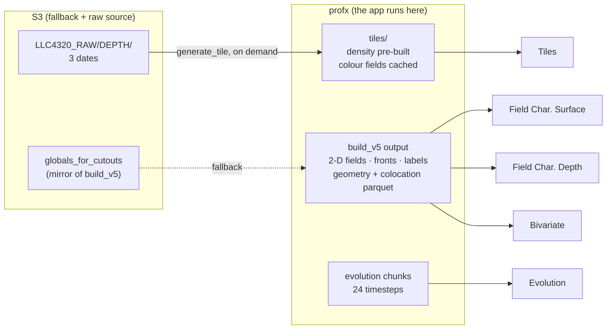

# Where each page gets its data

The app runs **on profx**, reads **profx's filesystem first**, and falls back
to S3 only when a file is missing locally or S3 is asked for explicitly.
That sidesteps the S3 connectivity problems and puts tile generation next to
the raw data.



## Per page

| Page | Reads | Dates | Pre-built? |
|---|---|---|---|
| **Field Char. Surface** | `build_v5` SURF products | 100 | yes |
| **Field Char. Depth** | `build_v5` DEPTH products, 4 depth levels | 3 | yes |
| **Bivariate** | geometry + colocation parquet | 100 (surf) / 3 (depth) | yes |
| **Tiles** | tile NetCDFs | 3 | density yes, fields lazy |
| **Evolution** | chunk NetCDFs, 24 consecutive steps | 1 window | yes |

## The three 3-D dates

`2012-05-16T06`, `2012-02-29`, `2012-11-09T12`. Everything depth-resolved —
the Depth page, Tiles, and the depth mode of Bivariate — is limited to these.
The Surface page has all 100.

## Depth levels

Already defined in the preprocessing repo as
`subset_definitions.DEFAULT_DEPTH_SUFFIXES`, so the page does not invent
names — it maps a label onto the suffix the channel already carries:

| Page label | Channel suffix | Example channel |
|---|---|---|
| Surface | `sfc` | `relative_vorticity_sfc` |
| 25 m | `z25m` | `relative_vorticity_z25m` |
| Mixed layer depth | `mld` | `relative_vorticity_mld` |
| Mean over mixed layer | `mld_mean` | `relative_vorticity_mld_mean` |

## Tiles: pre-built density, lazy everything else

A 720×720×90 float32 tile is about **187 MB**. Six regions × three dates ×
one field is 3.4 GB, so pre-generating every field is not on.

**Density is the exception** — every front needs it, in every field view,
because it drives the isopycnal geometry. So:

- **density**: pre-generated, 6 regions × 3 dates = 18 tiles, ~3.4 GB;
- **colour fields**: generated on first request, written to disk, **kept**.

Lazy tiles go into the standard tree `generate_tile` already writes to:

```
{netcdf-base}/{run-id}/{YYYYMMDD_HHMMSS}/tiles/{prefix}_tile{idx:03d}_{YYYYMMDDTHH}.nc
```

so the CLI and the app share one cache instead of each keeping its own. A
tile written by hand is picked up by the app, and vice versa.

**Timings.** Tile ≈ 15 s, 3-D scene ≈ 10 s, curtains ≈ 10 s. First view of a
new (region, date, field) ≈ 25 s; every later view ≈ 0 s. The **Regenerate**
button makes that cost explicit and user-triggered, so nudging a dropdown
never silently starts a 25-second job.

## Evolution: pre-generated

Scrubbing through 24 timesteps at 15 s a frame is unusable, so evolution
chunks are built ahead of time. One or two regions, chunk-sized (720×720),
24 consecutive hours. Density up front; colour fields may stay lazy there
too, since a field is picked once and then played through time.

## Serving it

The app binds to loopback on profx; an SSH tunnel carries it to the laptop.
Nothing is exposed on profx's network.

```bash
# on profx
python -m fronts.viz.apps.serve --port 5006 --address 127.0.0.1 \
    --allow-websocket-origin localhost:5006

# on the laptop, VPN up
ssh -L 5006:localhost:5006 you@profx
# browse http://localhost:5006
```

`--allow-websocket-origin` matters: without it Bokeh rejects the websocket
and the page loads but never draws.

To share with the group later, put nginx on profx with TLS and basic auth in
front of port 5006. Not needed for one user.

## Environment

```bash
export FRONTS_APP_DATA=profx           # profx | s3 | synthetic
export FRONTS_APP_ROOT=/mnt/tank/Oceanography/data/OGCM   # $OS_OGCM
export FRONTS_APP_TILE_BASE=...        # netcdf-base for the tile tree
export FRONTS_APP_S3_ROOT=s3://dbof/globals_for_cutouts/v2_2_01
export FRONTS_APP_CACHE=~/.cache/fronts-viz
export DISPLAY=dummy                   # PyVista >= 0.44
```

`FRONTS_APP_DATA=profx` reads local disk and falls back to S3 per file;
`s3` forces S3; `synthetic` needs no data at all.
