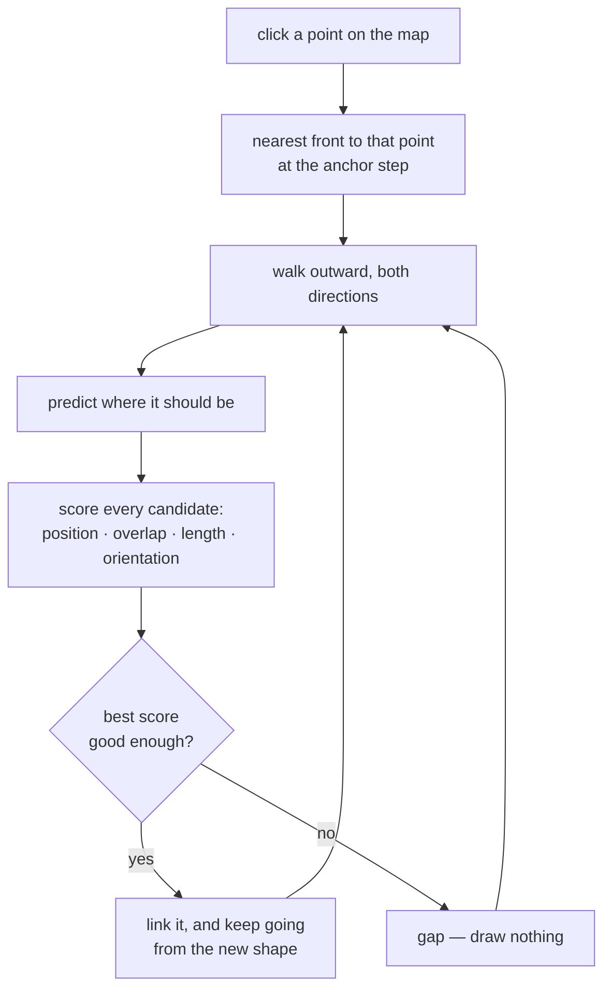

# Following a front through time

Code: [`fronts/front_tracking.py`](../../../fronts/front_tracking.py)

## The problem

Fronts are detected and labelled **independently at every timestep**. The
label is an artefact of the labelling pass, not a property of the ocean, so
the same physical front is called something different in every frame.

That single fact drives everything here. A movie that follows a *label*
does not follow a front — it jumps to whatever happens to carry that number
next, which is usually nothing at all.

## What it does now



**Selection is a place, not a label.** You click a point; the front whose
nearest pixel is closest to it is taken (within 80 km). A point on the
ocean means the same thing at every step, which a label does not.

**Matching is a score, not a distance.** Each candidate is measured
against what the front looked like when we last saw it:

| term | what it asks | scale for a penalty of 1.0 |
|---|---|---|
| position | distance from the **nearest point** of its predicted previous extent | the search radius |
| overlap | how much of its mask coincides with the last | no overlap at all |
| length | how much longer or shorter it has become | doubled or halved |
| area | how much bigger or smaller | doubled or halved |
| orientation | how far it has turned | 25° |

Terms are dimensionless, weighted (position 1.0, overlap 0.8, length 0.6,
orientation 0.6, area 0.4) and averaged. A candidate must beat **2.5** to
be accepted.

### Position is measured mask-to-mask, not centroid-to-centroid

This is the single most important detail, and getting it wrong made
tracking fail in a way that looked like bad tuning.

A front is an *extended* feature, and its centroid is a poor proxy for
where it is. A 400-cell front that extends 110 cells at one end has not
moved — but its centroid has shifted **55 cells**. Scored on centroid
distance that reads as implausible motion and is vetoed, so the true
continuation is discarded and a short unrelated front sitting beside it
becomes the only surviving candidate. The observed symptom is a track that
suddenly jumps to something much shorter and weaker some distance away.

Distance to the nearest point of the previous extent asks the question we
actually mean — *could this be the same water?* — and for a front that
grew at one end the answer is zero cells.

Implementation: the reference mask is shifted by the predicted motion, a
distance transform is taken once per step, and each candidate looks up its
own pixels in it. Terms whose inputs are missing are skipped and their weight
redistributed, so a front too small to have a meaningful orientation is not
penalised for lacking one.

**Position has a veto.** Beyond 3× the search radius a candidate is
rejected outright, whatever its shape. This is deliberate and it is the
subtle part: a candidate with *identical* shape a long way off is more
likely a different front that happens to look similar than the same front
teleporting. Shape breaks ties between plausible candidates; it must not
license implausible motion.

**The search is centred on a prediction.** With two prior sightings the
velocity is extrapolated and the front is expected to keep moving; with
one, the last position is used. This is free — it reuses positions already
measured — and it is what makes the long links work.

The radius floor is deliberately tight (2 cells). It exists to absorb
re-labelling jitter, and mask-to-mask distance leaves very little to
absorb — the two extents nearly coincide. A loose floor lets an hourly
link accept travel faster than a front moves.

**The radius scales with elapsed time, not step count.** A chunk is a week
of daily snapshots wrapped around one intensive day, so consecutive steps
can be one hour apart or twenty-four. A front that barely moves in an hour
travels tens of kilometres in a day; one fixed radius would either drop
every daily link or grab a neighbour inside the dense day.

**Gaps stay gaps.** Where nothing scores well enough, the step has no
front and the frame is drawn without one. A movie with a hole in it is
honest; one that confidently highlights the wrong front is not. A gap does
not end the track — the reference is kept, so the front can be
re-acquired later.

## Why position alone was not enough

The first version scored on distance only, and it drifted onto
neighbours. The failure is systematic rather than unlucky:

> A front that moves a long way between samples ends up **further from its
> own last position** than a stationary neighbour is.

So distance ranks the wrong front first exactly when the front is doing
something interesting. The shape terms break that tie, and they are
trustworthy for the same reason the whole approach is — consecutive
samples of one front cannot differ wildly in length or orientation.

## Two things that were quietly wrong

**Orientation was folded to 0–90.** That is the right convention for a
histogram of front orientations, and the wrong one for comparing two
fronts: a front tilted +40° and one tilted −40° both report 40°, so mirror
images looked identical. Tracking now uses a signed angle and wraps at
180°, because an axis has no direction — +89° and −89° are 2° apart, not
178°.

**Length was going to be pixel count.** A front that thickens would then
read as one that grew. It is the major-axis extent from second moments
instead.

## Confidence

There is no ground truth, so the honest substitute is saying which joins
were the closest calls. Every link carries its score and its individual
terms; `Track.weakest(n)` returns the least confident, and the page prints
them after a build:

```
front 96277 followed through 15/17 steps · 2 gaps · weakest links: step 7 (1.84), step 12 (1.10)
```

A weak link is where a track most likely jumped. It is worth looking at
that step in the region movie before trusting the sections.

## Where it lives, and why

`fronts/front_tracking.py`, **not** under `fronts/viz`.

Tracking is a statement about the ocean, not about a web page: it takes
label maps and timestamps and returns which label is which front. Under
`viz/apps/evolution/` it could only be reached by importing the app, so
analysis code could not use it without pulling in Panel. It has no
visualisation dependencies at all — numpy and `datetime`.
`fronts/viz/apps/evolution/tracking.py` remains as a re-export so existing
imports keep working.

---

## Worth doing next

Roughly in order of value for effort.

### 1. Advect with the velocity field, not with past positions

The prediction currently extrapolates from where the front has been. The
model knows where the water is going: `U` and `V` are already tile
properties, already rotated to geographic components. Advecting the front's
centroid by the mean velocity over its mask × Δt would be a far better
prediction than constant-velocity extrapolation, especially across the
daily gaps and at the first step after the anchor, where there is no
history to extrapolate from.

Cost: one extra tile composition per step, per component. Worth it only if
the daily links prove unreliable in practice.

### 2. Fronts merge and split; a 1:1 track cannot say so

Right now each step gets exactly one label or a gap. Real fronts merge and
split, and when they do the honest answer is not "here is the one true
successor" — it is "this front became two". A cheap first version: after
choosing the best candidate, report whether the *runner-up* also overlapped
the previous mask substantially. That is a merge or a split, and the page
could say so instead of silently picking one branch.

### 3. Assign all tracks at once, not greedily

With one track this does not arise. Follow several fronts and two tracks
can claim the same candidate, which cannot be right. A global assignment
(Hungarian algorithm on the score matrix) resolves that optimally and is a
few lines with `scipy.optimize.linear_sum_assignment`.

### 4. Check the track against itself

Without ground truth, the strongest available check is **cycle
consistency**: follow the front forwards to the end of the window, then
follow it backwards from there, and see whether you arrive at the front you
started from. Where the round trip fails, the forward track went wrong —
and it points at *which* step it went wrong on. This is worth building
before trusting any statistics computed along a track.

### 5. Use the colocation properties once they exist

`gradb2` and the other per-front statistics from build_v5 step 4 would make
good additional terms — a front's gradient strength is as continuous as its
length. They are not used today because **colocation has not been run for
V5**, so the tables are absent. The geometry table (step 3) does exist and
carries `length_km` and `orientation`; the current implementation measures
both from the mask instead, which needs no extra I/O and cannot disagree
with the pixels being drawn. When colocation lands, adding a `gradb2` term
is a few lines — `score_candidate` already skips terms whose inputs are
missing.

### 6. The weights are guesses

Position 1.0 / overlap 0.8 / length 0.6 / orientation 0.6, cutoff 2.5, are
reasoned but not calibrated. The way to calibrate them is a handful of
hand-labelled tracks — a person following a front through a window and
recording the labels — scored against what the algorithm produces. That is
half a day of work and would replace judgement with evidence.

### 7. Sub-front tracking

A long front is not one object: parts of it intensify while others decay.
Tracking the whole labelled feature hides that. Following the *front axis*
point by point — matching arc-length positions between steps — would let
the movie show which part of the front is doing what. This is a bigger
change and only worth it if the whole-front view proves too coarse to
answer the science question.
