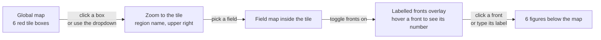

# `tiles` — one front, in 3-D and in cross-section

Route `/tiles`. Pick one of six regions, pick a field, click a front, get the
3-D scene plus five 2-D figures for that front.

> **Status: prototype, running on synthetic data.** Complete and working,
> including the live 3-D scene; see [WIRING.md](WIRING.md) to switch to the
> real stores.

## Flow



## What it shows

**Before selection** — the global map with six red boxes marking the tiles.

**After picking a region** — the map zooms to that 720×720 tile, with the
region name in the upper right, the selected field as the background, and the
labelled fronts optionally drawn on top.

**After picking a front** — six figures appear below the map:

| # | Figure | Built by | Kind |
|---|---|---|---|
| a | The selected field on the front's isopycnal surfaces | `fronts.viz.fronts_3d.render_3d` | 3-D scene |
| b | inset — plan view of the bbox with the axis, offsets and perpendicular marked | `plot_map_inset` | plan-view map |
| c | isopycnal — the front's density surface flattened to 2-D | `curtains.figure_isopycnal_surface` | curtain |
| d | mainaxis — the curtain along the front's longest path | `curtains.figure_main_axis` | curtain |
| e | offsets — the dilation summary rows plus each individual offset | `curtains.figure_offsets` | curtain |
| f | perpendicular — the cross-front transect | `curtains.figure_perpendicular` | curtain |

Figures (b)–(f) are what `fronts_viz_curtain.py` writes to disk — with one
difference: that script produces four PNGs by default, and the isopycnal figure
(c) only appears when `--isopycnal-curtain` is passed. The page always builds
it. Figure (a) is what `fronts_viz_3d.py` renders, live in the browser.

## The six regions

| Region | Centre (lat, lon) | Tile |
|---|---|---|
| Southern Ocean | *to choose* | |
| Gulf Stream | *to choose* | |
| California Current System | *to choose* | 330 *(if the runbook's window is kept)* |
| Equatorial Tropical Pacific | *to choose* | |
| Agulhas Current | *to choose* | |
| NE of Greenland | *to choose* | |

A "tile" is one 720×720 block on the rect grid; there are 432 of them, indexed
`tile_j*24 + tile_i`. Centres are resolved to a tile by
`dbof.tiles.tile_mapping.rect_ij_to_tile`, and the resolved index is recorded
in `common/regions.py` so the region list is reproducible.

Tile 330 covers rect `j` 9360–10079, `i` 12960–13679, which contains the
runbook's `--i 13142 --j 9956`. The `lat36.38_lon-124.20` in the runbook's
filenames is a **front centroid**, not a tile centre — a tile spans roughly
15°, so it is not a substitute.

## Controls

| Control | Effect |
|---|---|
| **date** dropdown | Which timestamp. One entry in the prototype. |
| **region** — click a red box, or dropdown | Zooms to that tile and loads its tiles. |
| **field** dropdown | 3-D tile fields — `Ri`, `N2`, `relative_vorticity`, `okubo_weiss`, `wB`, … |
| **show fronts** toggle | Draws the labelled fronts over the field. |
| **hover a front** | Tooltip shows the front's label number. |
| **click a front**, or type a label | Selects it and builds the six figures. |
| Rotate / zoom in the 3-D pane | Standard VTK interaction, in the browser. |

Hover works by rasterizing the label mask with a `max` aggregator and attaching
a hover tool — the declarative replacement for the hand-written CustomJS in
[front_viz_groups_bokeh](../front_viz_groups_bokeh.md).

**Why the field list is hardcoded.** Only 3-D fields belong in the dropdown:
the 2-D entries (`mixed_layer_depth`, `Eta`, `oceTAUX`, …) have no `Z` coord
and the tile loaders reject them. But `dbof.tiles.field_registry.TileProperty`
carries no dimensionality flag — its fields are `name, vars_needed, out_name,
units, long_name, filename_prefix, compute, edge_margin` — so the registry
cannot be filtered. Since we do not edit that repo, the page keeps an explicit
allow-list, with a test asserting every name in it still exists in
`TILE_PROPERTIES`.

## Where the data comes from

Two sources.

**3-D tiles** — pre-generated from
`s3://dbof/LLC4320_RAW/DEPTH/20120516T06.zarr/` with
`dbof.cli.generate_tile`, one density tile plus one tile per field per region:

```bash
python -m dbof.cli.generate_tile \
    --i 13142 --j 9956 --timestamp '2012-05-16 06:00:00' \
    --property density --output "$TILES"

python -m dbof.cli.generate_tile \
    --i 13142 --j 9956 --timestamp '2012-05-16 06:00:00' \
    --property Ri --output "$TILES"
```

The app only reads the resulting NetCDF, so region selection is instant. See
[fronts_viz_3d_runbook.md](../fronts_viz_3d_runbook.md) for the full recipe.

**Nothing existing is reusable.** The runbook's tiles are at
`2012-11-09 12:00`, run V4. Every tile for this prototype must be regenerated
at `2012-05-16 06:00`.

**2-D products** — from
`s3://dbof/globals_for_cutouts/v2_2_01/20120516_060000/`, produced by
`build_v5.py`: the field map, the binary front mask, the grouped/labelled
fronts, and the colocated properties.

Inside a single tile the grid is small and locally well-behaved, so this page
does not need the display pyramid that [characteristics](characteristics.md)
uses — it reads the tile NetCDF directly.

## Pipeline behind the figures

Unchanged from the batch scripts:

1. Load the density tile, the field tile, and the labels; check provenance
   matches.
2. Remap σ₀, the field, `XC` and `YC` onto the rect frame.
3. Resolve the clicked pixel to a front label.
4. Crop to the front's bounding box plus a margin.
5. Compute the MLD field and clip depth to a few levels below it.
6. Extract the main axis (skeleton diameter, side branches dropped), derive
   path metrics, offsets and the perpendicular.
7. Render.

[fronts_curtain.md](../fronts_curtain.md) and
[fronts_viz_3d.md](../fronts_viz_3d.md) document each step and every tuning
knob. The page exposes the ones worth changing interactively — number of
offsets, perpendicular half-width, colour limits — and leaves the rest at
their defaults.

## Requirements

The 3-D pane needs the OSMesa VTK build and `DISPLAY=dummy` from step 0 of
[fronts_viz_3d_runbook.md](../fronts_viz_3d_runbook.md). Without it, figures
(b)–(f) still render — they are matplotlib only — and (a) reports the missing
GL backend rather than failing the page.

## When to use this vs. the other viewers

- Use **tiles** to interrogate one front in depth.
- Use [characteristics](characteristics.md) for statistics over a region.
- Use [fronts_viz_curtain](../fronts_curtain.md) and
  [fronts_viz_3d](../fronts_viz_3d.md) directly when batch-rendering many
  fronts to disk, or on a cluster with no browser.
