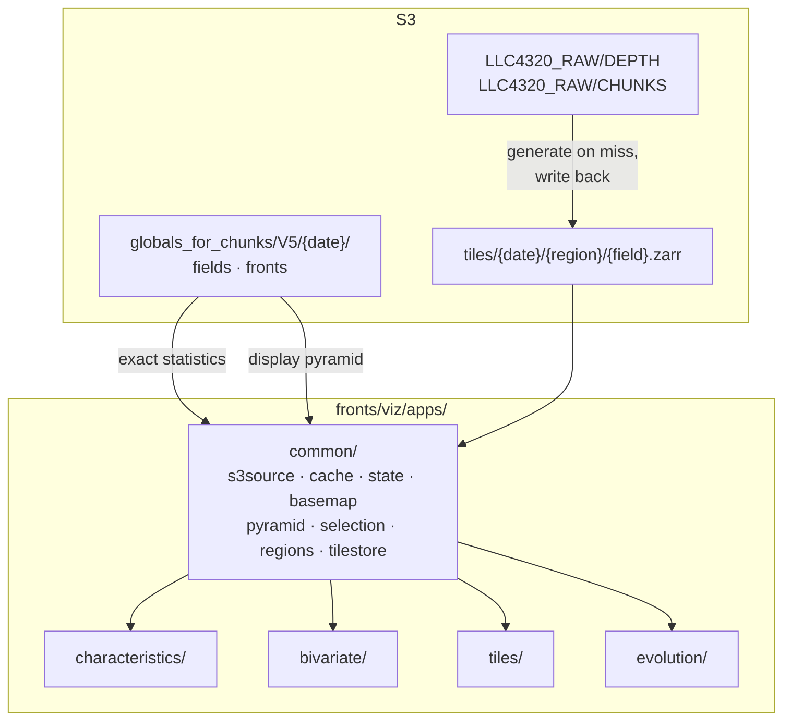
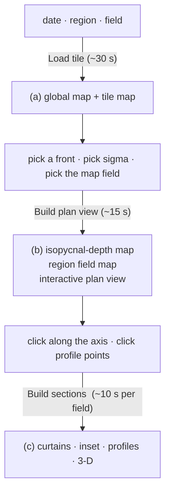

# Build plan — front visualisation web tool

Four browser pages for exploring LLC4320 fronts, served by one
`panel serve` process out of `fronts/viz/apps/`. Every page has the same
shape: **global map → pick something → get figures for it.**

Three of the four are built and in use. Evolution is specified but not
finished; its section below is the outstanding work.

| Page | Route | What you look at | Status |
|---|---|---|---|
| **Field Characteristics** | `/surface` | statistics of a field over a lat/lon box you draw | built |
| **Bivariate** | `/bivariate` | fronts coloured by a two-field scheme | built |
| **Tiles** | `/tiles` | one front inside a 720×720 tile, in section and in 3-D | built |
| **Evolution** | `/evolution` | one front over 24 hours, as a movie | **to build** |

A Depth twin of Field Characteristics, and a Depth mode for Bivariate,
are complete and tested but not served — they are hidden by
`config.ENABLED_PAGES` and `config.BIVARIATE_MODES` rather than deleted,
so putting the names back brings them straight back.

---

## 1. The grid problem — read this before touching a map

**The LLC4320 rect grid is not a regular lat/lon grid.** This is the
single biggest constraint in the whole tool and it is easy to get wrong.

The grid is 12960 × 17280, stitched from 13 native faces — some rotated
to tile correctly. `XC` and `YC` survive as **2-D** arrays. So:

- latitude spacing is not uniform (the `j` axis is Mercator-like);
- longitude is only *approximately* column-aligned;
- `hv.Image` assumes a regular 1-D axis per dimension, so it silently
  misplaces data. Only `hv.QuadMesh` with 2-D coordinates is strictly
  correct, and datashading a curvilinear QuadMesh at 224M points is far
  too slow to drive an interactive map.

The resolution is to **split display from statistics**:

| Path | Grid | Correctness |
|---|---|---|
| the map | regridded offline onto a regular lat/lon pyramid | good enough to look at; never feeds a number |
| the numbers | native rect grid, read directly | exact, full resolution |

`common/pyramid.py` bins the native field into regular lat/lon rasters at
`PYRAMID_WIDTHS = (1440, 2880, 5760, 11520)`. Once that exists,
`hv.Image` is both correct and fast, and Pacific-centring is a column
roll — on the regridded raster, where the grid really is regular.

**Selecting a box never converts to indices.** `common/selection.py`
masks on the coordinate arrays directly:

```python
mask = (YC >= lat0) & (YC <= lat1) & (XC >= lon0) & (XC <= lon1)
```

One vectorised pass, exact, and correct on the irregular grid by
construction — because it asks about coordinates instead of assuming
positions. (The brute-force nearest-neighbour in `fronts/llc/coords.py`
allocates ~1.8 GB per query point; fine for a CLI, unusable behind a
box-select.)

---

## 2. Data

Everything the pages read sits under one prefix, for exactly four dates:

```
s3://dbof/globals_for_chunks/V5/{YYYYMMDD_HHMMSS}/
    {subset}.zarr        fields, surface and depth
    Fronts/              binary, labels, geometry
```

| date | prefix |
|---|---|
| 2012-02-29 18:00 | `20120229_180000` |
| 2012-05-16 06:00 | `20120516_060000` |
| 2012-09-18 11:00 | `20120918_110000` |
| 2012-11-09 12:00 | `20121109_120000` |

| What | Where |
|---|---|
| 3-D source for tiles | `s3://dbof/LLC4320_RAW/DEPTH/` |
| generated tiles | `s3://dbof/tiles/{date}/{region}/{field}.zarr` |
| Evolution chunks | `s3://dbof/LLC4320_RAW/CHUNKS/{chunk}/{YYYYMMDDTHH}.zarr` |
| endpoint | `https://s3-west.nrp-nautilus.io` |

Chunks exist for `monterey_bay` and `southern_ocean_scotia_sea`.

Full detail in [docs/viz/apps/DATA.md](../docs/viz/apps/DATA.md).

### What it costs, and why the design looks like this

The global stores are chunked `(1, H, W)` — **one chunk per channel**, so
there is no such thing as a partial read. Every field plane is 0.83 GB,
and measured throughput to the bucket is ~28 MB/s. So a cold field is
~30 s and a cached one is ~1 s, and the whole app is bound by S3 traffic
rather than by CPU.

Everything follows from that:

- field planes, the ice mask, and `XC`/`YC` are cached to disk as `.npy`
  and read back **memmapped** (`common/cache.py`);
- `XC` on the reader is a *property* that re-reads 0.9 GB on every
  access, so it is touched once and kept;
- the land mask comes from the field's own NaNs rather than a separate
  0.9 GB `hFacC` read;
- the disk cache is LRU-trimmed to `CACHE_CAP_BYTES` (10 GB default);
- tiles are generated once, written back to `s3://dbof/tiles/`, and read
  from there forever after.

**Nothing is computed until you ask for it.** Every expensive stage is
behind an explicit button, and the button says what it is about to do.

---

## 3. Architecture



```
fronts/viz/apps/
  serve.py                 routes, filtered by config.ENABLED_PAGES
  config.py                dates, paths, field lists, caps — one place
  build_tiles.py           batch tile generation CLI
  check_s3.py  check_tiles.py  warm.py      diagnostics / prefetch
  common/
    s3source.py   the provider: fields, masks, fronts, tiles
    tilestore.py  read/write the generated-tile store
    cache.py      disk cache + LRU trim
    state.py      one param.Parameterized per page
    basemap.py  pyramid.py  selection.py  regions.py  widgets.py
  characteristics/  page.py (shared) + surface.py / depth.py + panels + stats
  bivariate/  tiles/  evolution/
```

Two things worth knowing about the shape:

**The figure builders are the repo's existing code.** `curtains.figure_*`,
`fronts_3d.render_3d`, `plot_map_inset`, `dbof.plotting.pdfs` / `jpdfs`
are called unchanged. The app is a shell around them.

**State is `param.Parameterized`, so the whole thing is testable
headlessly.** Set date/field/region/front, assert the derived values. Only
the Panel layout goes untested, which is the right thing to leave
untested.

**We do not edit the `llc4320-native-grid-preprocessing` repo** from
here. It is imported (`dbof.tiles.field_registry`, `dbof.tiles.tile_utils`,
`dbof.plotting.*`) and its tile-composition steps are reproduced in
`s3source._compose_tile`, so the app does not depend on which branch is
checked out.

---

## 4. Field Characteristics (`/surface`)

```
+---------------------------------+------------------+------------------+
|                                 |   ALL GRID PTS   |   FRONTS ONLY    |
|      GLOBAL MAP                 | (a) PDF of field | (a) PDF of field |
|      Pacific-centred            | (b) JPDF strain  | (b) JPDF strain  |
|      land gray, coastlines      |     vs vorticity |     vs vorticity |
|      [drag a box to select]     | (c) conditional  | (c) conditional  |
|                                 |     JPDF         |     JPDF         |
+---------------------------------+------------------+------------------+
|  front properties: (a)-(f)  length · orientation · JPDFs vs latitude  |
+-----------------------------------------------------------------------+
```

**Navigation is not computation.** Box-select and *Reset region* move the
map immediately; only the panels below wait for *Rebuild*. This is the
rule the page is built around, and getting it wrong was the source of a
whole family of bugs (see §7).

The six front-property panels come from the geometry parquet, filtered to
fronts whose centroid falls in the box. Panels (e) and (f) additionally
need a per-front field statistic from the colocation table, and carry
their own **statistic** selector (`mean`, `median`, `p25`, `p75`, `p90`
— built from the columns actually present, so adding `p95` upstream makes
it appear). Colocation has not been run for V5, so (e) and (f) are
degraded and the panels fall back to geometry alone rather than failing.

---

## 5. Bivariate (`/bivariate`)

A full-width map of fronts coloured by a **two-field** scheme, generalised
out of `Bivariate_TurnerAngle.ipynb` into `fronts/viz/bivariate.py`:

| Function | Role |
|---|---|
| `bivariate_colormap(n, hue_a, hue_b)` | `(n, n, 3)` grid; lightness carries A, hue carries B |
| `assign_bins(values_a, values_b, n, edges=...)` | bin index per front |
| `plot_bivariate_map(df, ...)` | scatter or spatially binned |
| `plot_bivariate_legend(...)` | the `n × n` legend square |

Two details from the notebook are worth preserving:

- **Quantile edges, not equal-width**, as the default — front properties
  are heavy-tailed and equal-width bins put nearly every front in one
  cell.
- **A physically meaningful split beats a quantile split when one
  exists.** Turner angle splits at 0°, not at its median. So
  `assign_bins` accepts explicit edges and the registry names a natural
  split for the fields that have one.

The notebook still works and can import these instead of defining them.

---

## 6. Tiles (`/tiles`)

The page is **three stages**, cheapest first, each behind its own button
on its own row. Stage 1 invalidates stage 2; stage 2 never invalidates
stage 1. One arrow, never a cycle — which is what keeps three buttons
comprehensible.



**(a) Overview.** Global map with the region boxed in red — derived from
the tile's *own* `XC`/`YC`, not from a nominal centre, so the box lands
where the tile actually is. Below it, the tile itself, on **lat/lon**
axes.

**(b) Plan view and maps.** The isopycnal-depth map shows the whole tile:
colour is the depth at which `sigma0 == sigma`, **gray** where the
isopycnal does not exist in the column (the surface has outcropped —
a physical statement, not missing data), all fronts in cyan, the selected
one in **red**. Beside it, the same treatment for any chosen field. The
plan view is the interactive one: click to set the cross-front transect,
switch mode and click to drop up to 5 profile points.

**(c) Sections**, one column per selected field (up to three):

| # | Figure |
|---|---|
| a | 3-D field on the front's isopycnals (`pn.pane.VTK`) |
| b | inset — plan view, two rows: surface and a chosen depth |
| c | isopycnal surface |
| d | main-axis curtain |
| e | along-front offsets |
| f | cross-front transect |
| — | vertical profiles, one line per picked point |

The geometry — front, crop, main axis, transect point — is computed
**once** and shared across the columns, so only the colour field differs.
That is both faster and the only reason the columns are comparable at all.

Axis tick distances are drawn on both the plan view and the section
x-axes, so a feature in a section can be found on the map.

Offsets in front of and behind the front are colour-coded, with a
two-entry legend saying which is + and which is −.

### Field list

`config.TILE_FIELDS_3D`. Surface-only quantities are deliberately absent:
`ug`, `vg`, `frontogenesis_geo` and `frontogenesis_ageo` need the
SSH-derived geostrophic velocity, and `KE` is built from the mixed-layer
depth — all exist at one level, so there is nothing to section through.

---

## 7. Conventions learned the hard way

Short list, but each one cost a day.

**A HoloViews stream must be attached to what is actually rendered.** A
`Tap` or `BoundsXY` bound to an element that is then composed into an
Overlay never reaches the renderer. Use a **sourceless** stream as a
`DynamicMap` stream instead.

**Never redraw inside a stream callback.** It destroys the plot the tool
belongs to — which resets the zoom and kills the stream. The pattern that
works everywhere is *static base + dynamic markers*: build the image and
the axis once, put only the markers in a `DynamicMap`.

Those two together are the root cause of the entire "clicking does
nothing / the zoom jumps back / the selection is lost" family, on both
the plan view and the Field Characteristics map.

**`shared_axes=False`**, or HoloViews links the axes of any two plots
sharing a dimension name — which is why zooming the tile map used to zoom
the plan view.

**Do not trust the dim order of a tile variable.** xarray puts the first
operand's dims first, so `mld(j,i) * grad(k,j,i)` comes back `(j,i,k)`
and gets written to the store that way. Read 3-D tile variables through
`pipeline.field_values`, which transposes by dim *name*.

**Other small traps.** `sizing_mode` is not a valid Overlay option
(`responsive=True` is). matplotlib rejects cmocean names, so colour maps
go through `field_styles.resolve_cmap`. `Widget.name` is deprecated and
silently breaks two-way param links — use `.label`.

---

## 8. Evolution — the same figures, as a movie

*(Carried over unchanged: this is the outstanding work.)*

Evolution gets the Tiles figures, with **one field at a time** rather
than a column per field — a movie of three fields is three movies, which
is not a page. The chunk window supplies the frames.

Layout:

* a global map with the chunks boxed, and the chunk map at the current
  step;
* three time series — **(a)** length, **(b)** orientation, **(c)** the
  field's statistics — with a cursor that moves with playback, so you can
  always see where in the window the figures below are;
* **(d)–(i)** the six figures, one frame per step.

Playback swaps pre-rendered images. Rendering costs roughly ten seconds a
frame, so building the movie is an explicit, progress-tracked step and the
result is cached — after which scrubbing is instant.

Decisions already taken:

| Question | Choice |
|---|---|
| Isopycnal `SIGMA` | free number input, defaulting to the tile's median density |
| Profile locations | up to 5, cleared when the front changes |
| Isopycnal map on Evolution | animates with the rest of the movie |

Profiles are cleared per front because the points are picked in the
front's *crop* frame: on a different front the same pixel is a different
place, so keeping them would silently plot the wrong column.

### Still to settle

**Front tracking is the hard part, and it is a design question, not a
bug.** Fronts are labelled per timestep, so the same physical front has a
different label in every frame. A movie that follows a *label* will jump
to an unrelated front. So the movie must anchor on the front's **lat/lon
location** and keep that window, accepting that the label changes
underneath it.

The rest of the outstanding asks:

- **(a)** the global map shows both regions outlined in red with `gradb2`
  in the background; *Load chunk* has a progress bar, and finishing it
  updates the "chunk at this step" map automatically;
- **(b)** the chunk figure for one timestep: `gradb2` in the background
  at higher resolution, with the fronts plotted over it;
- a **date** control alongside the chunk control — which timestep the
  regional map shows should be explicit, not implied;
- `include_3d` must actually be configurable.

---

## 9. Open

- **Colocation (build_v5 step 4) has not been run for V5.** Until it is,
  Field Characteristics panels (e)/(f) and the Bivariate map stay
  degraded.
- **Tiles are missing for `20120918_110000` and `20121109_120000`** —
  `build_tiles --all-fields` fills them.
- **Chunk fronts are not wired up.** Needs build_v5 steps 2–3 over the
  chunk windows.
- Optionally `hv.QuadMesh` in place of the linearised `hv.Image` axes, if
  the curvilinear error ever starts to matter.
