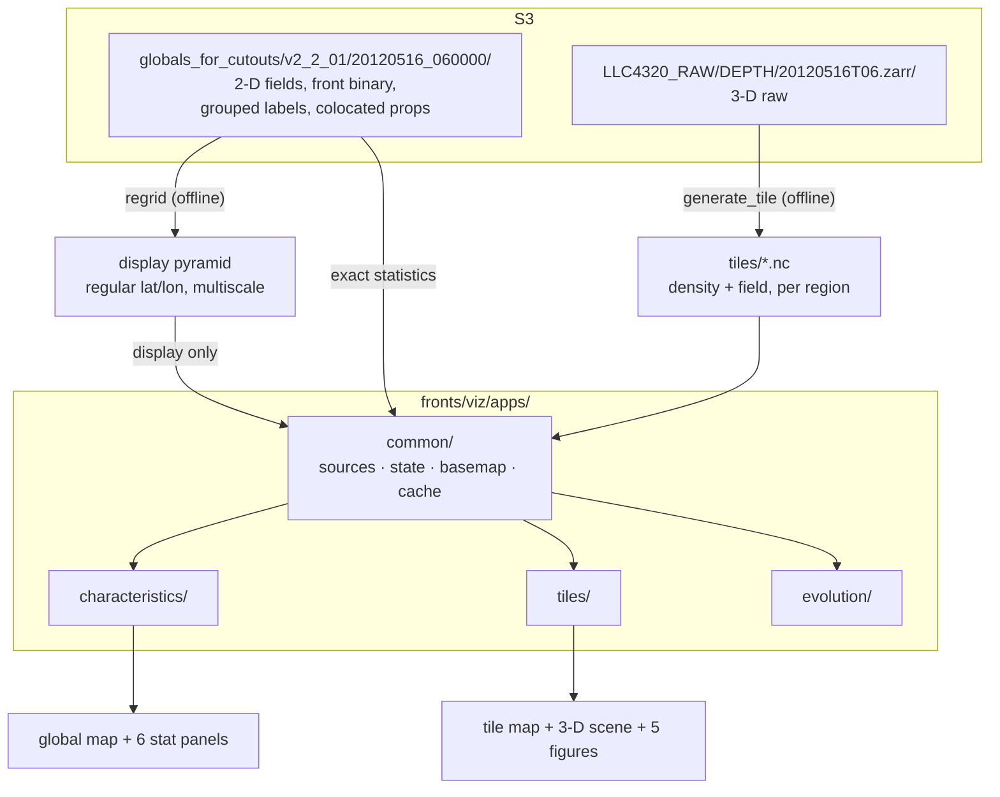
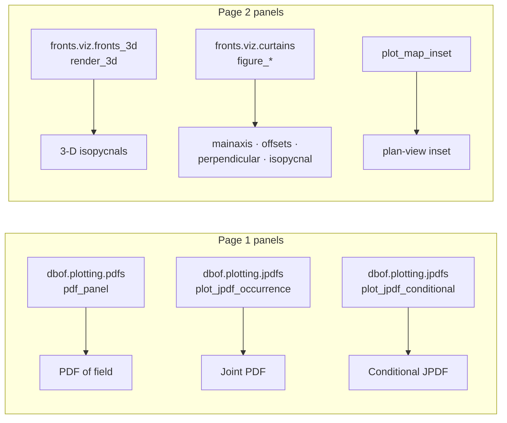
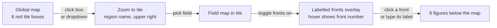

# Build plan — front visualisation web tools

Three browser pages for exploring LLC4320 fronts. Every page follows the same
shape: **global map → pick a region → get plots for that region.** The plots
differ per page.

| Page | Name | What you look at | Data |
|---|---|---|---|
| 1 | **characteristics** | Statistics of a field over a lat/lon box you draw | surface globals |
| 2 | **tiles** | One front inside a 720×720 tile, in 3-D and in cross-section | 3-D raw tiles |
| 3 | **evolution** | *(specified later)* | *(later)* |

This prototype covers **one date only**: `2012-05-16 06:00`. The date widget
exists from day one but has a single entry; nothing else is written assuming
one date.

---

## 1. Decisions

| Decision | Choice | Why |
|---|---|---|
| Stack | **Panel + HoloViews + Datashader + GeoViews + Param** | Only Python stack that embeds our matplotlib curtains *and* our PyVista 3-D scene, and the only one that renders a 224-million-pixel grid without shipping it to the browser. |
| Serving | One `panel serve`, three routes | Shared data cache across pages; one process to run. |
| 3-D render | Live `pn.pane.VTK` | `fronts_3d.render_3d()` already returns a `pv.Plotter` — hand it straight to Panel. Needs the OSMesa env from the existing runbook. |
| Code location | `fronts/viz/apps/` | Keeps the web stack out of `fronts.viz`. See §7 R5 — this only works if `fronts/viz/__init__.py` is made lazy. |
| Region statistics | **Exact, full resolution** | No decimation in the numbers. The whole-globe default is precomputed once and cached so first load is not a several-minute wait. |
| Map display | **Precomputed regular-grid pyramid** | The native grid is *not* regular lat/lon (§4). Regridding once for display is the only way to get a correct, fast map. Statistics never touch the pyramid. |
| 3-D tiles | Pre-generated | `dbof.cli.generate_tile` run ahead of time per region per field. App only reads NetCDF. |

**Non-goal:** we do not edit the `llc4320-native-grid-preprocessing` repo. We
import from it (`dbof.plotting.jpdfs`, `dbof.plotting.pdfs`,
`dbof.tiles.field_registry`, `dbof.tiles.tile_mapping`) and shell out to its
CLI.

---

## 2. Architecture



### Where the plots come from



Every one of these is an existing, working function. The app is a shell around
them — but see §7: several need small changes before they can be called from a
server.

---

## 3. Directory layout

```
fronts/viz/apps/
  __init__.py
  serve.py                 # `panel serve` entrypoint; wires the 3 routes
  common/
    sources.py             # open + cache S3 zarr / npy / parquet
    state.py               # Param classes: Date, Field, Region, Front
    basemap.py             # global map from the display pyramid
    pyramid.py             # build + read the regular-grid display pyramid
    selection.py           # lat/lon box -> boolean mask on the native grid
    widgets.py             # shared dropdowns, toggles, status bar
    cache.py               # disk + memory cache keyed on (date, field, bbox)
    regions.py             # the 6 named regions -> lat/lon -> tile_idx
  characteristics/
    app.py                 # page assembly
    stats.py               # exact PDF / JPDF / conditional-JPDF computation
  tiles/
    app.py
    panels.py              # 3-D pane + the 5 figure panes
  evolution/
    app.py                 # stub for now
```

Docs mirror this at `docs/viz/apps/`.

---

## 4. The grid problem — read this before writing the map

**The LLC4320 rect grid is not a regular lat/lon grid.** This is the single
biggest technical constraint on page 1 and it is easy to get wrong.

The rect grid is 12960 × 17280, produced by stitching 13 native faces. As
`faces_to_latlon.py` puts it: *"This is NOT interpolation — values are
pixel-shifted and some faces are rotated to tile correctly, but we remain on
the native LLC grid."* `XC` and `YC` survive as **2-D** arrays. Three
consequences:

- **Latitude is definitely not uniform.** 17280 columns over 360° gives
  1/48° per column; 12960 rows at that spacing would span only 270° of
  latitude. The `j` axis is isotropic/Mercator-like.
- **Longitude is only approximately column-aligned**, over the lat-lon faces.
  The existing `viz_loaders.compute_longitude_shift` samples a single middle
  row and assumes it holds for all rows. That has worked for the existing
  viewers; it is an assumption, not a guarantee.
- **`hv.Image` would silently misplace data.** It assumes a regular 1-D axis
  per dimension. Only `hv.QuadMesh` with 2-D coordinates is correct — and
  datashading a curvilinear QuadMesh at 224M points is far too slow to drive
  an interactive map.

### How we handle it

**Split display from statistics.**

| Path | Grid | Correctness |
|---|---|---|
| **Display** (the map) | Regridded once, offline, onto a regular lat/lon multiscale pyramid | Exact enough to look at; never feeds a number |
| **Statistics** (the six panels) | Native rect grid, read directly | Exact, full resolution |

`common/pyramid.py` builds the pyramid: nearest-neighbour bin the native field
into a regular lat/lon raster at a few zoom levels, stored as zarr, one per
(date, field). Once that exists, `hv.Image` + datashader is both correct and
fast, and Pacific-centring really is just a column roll — on the regridded
raster, where the grid genuinely is regular.

### Selecting a box

**Do not convert the box to array indices.** `fronts/llc/coords.py` does
lat/lon → (i, j) by brute-force nearest neighbour, allocating a full
12960×17280 float64 distance array (~1.8 GB) per query point. That is fine for
a one-off CLI call and unusable behind an interactive box-select.

Instead, `common/selection.py` builds a boolean mask directly on the 2-D
coordinate arrays:

```python
mask = (YC >= lat0) & (YC <= lat1) & (XC >= lon0) & (XC <= lon1)
```

One vectorised pass, dask-friendly, exact, and no search at all. It handles
the irregular grid correctly by construction, because it asks about
coordinates rather than assuming positions.

**Risk:** the pyramid build is the one genuinely new piece of machinery in this
plan. Spike it at Milestone 2 before building anything on top of it.

---

## 5. Page 1 — characteristics

### Layout

```
+---------------------------------+------------------+------------------+
|                                 |   ALL GRID PTS   |   FRONTS ONLY    |
|                                 +------------------+------------------+
|      GLOBAL MAP                 | (a) PDF of field | (a) PDF of field |
|      Pacific-centred            +------------------+------------------+
|      land gray, coastlines      | (b) Joint PDF    | (b) Joint PDF    |
|      lat/lon labels             |     strain vs    |     strain vs    |
|                                 |     vorticity    |     vorticity    |
|      [drag a box to select]     +------------------+------------------+
|                                 | (c) Conditional  | (c) Conditional  |
|                                 |     JPDF on      |     JPDF on      |
|                                 |     {field}      |     {field}      |
+---------------------------------+------------------+------------------+
  [date v] [field v] [x] show fronts        region: global | 30N-45N, 130W-115W
```

### Controls
- **date** — dropdown, one entry for now
- **field** — dropdown, populated from the channels present in the date's
  subsets
- **show fronts** — toggle, overlays the binary front mask on the map
- **region** — drag a box on the map; default is the whole globe

`hv.streams.BoundsXY` on a BoxSelect tool gives `(lon0, lat0, lon1, lat1)`,
which goes to `selection.py` (§4), not to an index lookup.

### The six panels
Left column uses every grid point in the box. Right column uses only front
pixels, from the colocated output.

- **(a) PDF of {field}** — `dbof.plotting.pdfs.pdf_panel(ax, values, bins)`,
  with `shared_bins()` so both columns share an axis
- **(b) Joint PDF** — `jpdfs.plot_jpdf_occurrence(ax, zf, sf)`, normalised
  strain σ/|f₀| vs relative vorticity ζ/f₀
- **(c) Conditional JPDF** — `jpdfs.plot_jpdf_conditional(ax, zf, sf, c)` with
  `c` = the selected field; `plot_jpdf_conditional_log` for positive-definite
  fields such as `gradb2`

All three take a matplotlib axis → wrap in `pn.pane.Matplotlib`. These three
genuinely need no changes.

**Channel names — check before building.** The panels need vorticity, strain
and Coriolis. Those exist in `subset_definitions.py` as `relative_vorticity`,
`strain_n`, `strain_s`, `strain_mag`, `coriolis_f` on the **SURFACE** pipeline.
On the **DEPTH** pipeline they carry depth suffixes — `relative_vorticity_sfc`,
`strain_mag_mld`, … — and `coriolis_f` moves to `extra_channels`. Which
pipeline produced `globals_for_cutouts/v2_2_01` decides the names. **Resolve
this at Milestone 0 by listing the actual store**, not by reading the config.

**Note:** `dbof/plotting/jpdfs.py` carries a header saying it is the port
target for `fronts/properties/analysis/jpdf.py`. Use the `dbof` version, as
specified, and reconcile the two later.

### Exact statistics without a frozen UI
The numbers are exact at full resolution:

1. Display and statistics are **separate paths** (§4).
2. **Chunk-aligned dask read** of only the masked region.
3. **Background thread + progress bar** so the UI stays live while a large box
   computes. Panels grey out and repopulate when done.
4. **Cache on `(date, field, bbox, fronts_only)`** — re-selecting is instant.
5. **Precompute the global default** offline into that cache, so the page opens
   on an exact result rather than a cold multi-minute compute.

---

## 6. Page 2 — tiles

### Flow



Inside a single tile the grid is small and locally well-behaved, so page 2 does
not need the pyramid — it reads the tile NetCDF directly.

### Controls
**date → region → field → front.** Region is clickable on the map *and* a
dropdown.

Hovering a front pixel shows its label, via
`datashader.rasterize(labels, aggregator=ds.max('label'))` plus a hover tool —
the declarative replacement for the hand-written CustomJS in
`front_viz_groups_bokeh.py`. `hv.streams.Tap` gives click-to-select.

**Field list — needs a new registry field.** The dropdown should offer only
3-D fields, because the 2-D ones (`mixed_layer_depth`, `Eta`, `oceTAUX`, …)
have no `Z` coord and the tile loaders reject them. But
`dbof.tiles.field_registry.TileProperty` has no dimensionality flag — its
fields are `name, vars_needed, out_name, units, long_name, filename_prefix,
compute, edge_margin`. Today the 2-D fields are only discovered at load time.
Since we do not edit that repo, page 2 carries an explicit allow-list in
`common/regions.py`'s neighbour module, with a test asserting every name in it
still exists in `TILE_PROPERTIES`.

### The six figures
| # | Figure | Source |
|---|---|---|
| a | 3-D field on the front's isopycnals | `fronts.viz.fronts_3d.render_3d()` → `pn.pane.VTK` |
| b | plan-view inset | `plot_map_inset` |
| c | isopycnal | `curtains.figure_isopycnal_surface` |
| d | mainaxis | `curtains.figure_main_axis` |
| e | offsets | `curtains.figure_offsets` |
| f | perpendicular | `curtains.figure_perpendicular` |

Four of these are curtains; (b) is a plan-view map and (a) is the 3-D scene.
Note that `fronts_viz_curtain.py` writes only four PNGs by default — the
isopycnal figure (c) is behind `--isopycnal-curtain`. The app always builds it.

The pipeline behind them is the one in
[`fronts_viz_3d_runbook.md`](../docs/viz/fronts_viz_3d_runbook.md) — load two
tiles (density + field), remap to the rect frame, pick the label, crop, clip to
MLD, render.

**No existing tile is reusable.** The runbook's tiles are `2012-11-09 12:00`,
run V4. Every tile for this prototype must be regenerated at
`2012-05-16 06:00`.

---

## 7. Prerequisite changes

The app needs code that currently cannot be imported from a long-running
server process. **Do these first** — they are small, mechanical, and each is
independently testable.

| # | Change | Why |
|---|---|---|
| **R1** | Move `load_density_tile`, `load_tile`, `load_labels_tile`, `build_tile_lookup`, `tile_scalar`, `attach_lonlat_twins` from `dev/mld/density_utils.py` into `fronts/viz/tile_io.py` | `dev/` is not an installed package (no `__init__.py`, not in `find_packages()`). Both viz scripts reach it via `sys.path.insert(...)` at import time, which only resolves from a source checkout. |
| **R2** | Move `pick_front_label` and `remap_to_rect` from `fronts/scripts/fronts_viz_3d.py` into `fronts/viz/fronts_3d.py`; move `plot_map_inset` and `pick_isopycnal_levels` out of `fronts/scripts/fronts_viz_curtain.py` | These *are* importable (`fronts.scripts` is a real package) — but importing either script runs its `sys.path` hack, and `fronts_viz_curtain.py` calls `matplotlib.use("Agg")` at module level, which would clobber the backend for the whole server process. |
| **R3** | Put `plot_map_inset` in a **new** `fronts/viz/map_inset.py`, not `insets.py` | `fronts/viz/insets.py` already exists and exports `plot_bbox_inset`. Two near-homonyms in one module is a trap. |
| **R4** | Make `output_path` optional on `figure_main_axis`, `figure_offsets`, `figure_perpendicular`, `figure_isopycnal_surface` **and `plot_map_inset`** — `None` → skip `savefig`/`close`, return the `Figure` | All five currently `savefig` → `plt.close(fig)` → `return output_path`. The figure is closed, so `pn.pane.Matplotlib` cannot consume it. `output_path` is **positional** in all five (and in `figure_offsets` it sits after `n_offsets`), so this means giving it a default and updating the docstrings' `Returns` sections. Backward compatible: existing callers pass a path and still get a path. |
| **R5** | Make `fronts/viz/__init__.py` lazy | It currently does `from . import properties`, and `fronts/viz/properties.py` imports cartopy at module level. So `import fronts.viz.curtains` *already* drags in cartopy, pandas and scipy. Until this is fixed, "keeps the web stack out of `fronts.viz`" is aspirational. |

R1 and R4 are the load-bearing ones. R1 is what makes the tile loaders
importable at all; R4 is what lets us use `pn.pane.Matplotlib` instead of
round-tripping PNGs through disk.

---

## 8. Shared layer (`common/`)

### `sources.py`
One cached function per artefact, all taking `(date, ...)`:
`open_field`, `open_front_binary`, `open_labels`, `open_colocated`,
`open_geometry`.

`fronts.properties.viz_loaders` already does most of this for local paths
(`load_labeled_array`, `load_geometry_table`, `load_colocation_table`,
`merge_geometry_colocation`, `load_global_front_results`). **Reuse it**; add an
S3-aware path resolver rather than writing new loaders.

### `state.py`
Each page is one `param.Parameterized` holding `date / field / region /
front`, with data loading and computation as methods. The Panel layout is a
thin view over it. **Consequence: the whole state machine is unit-testable
headlessly**, which matters given the existing pytest suite.

### `regions.py`
The six page-2 regions as `(name, lat, lon)`, resolved to a tile via
`dbof.tiles.tile_mapping.rect_ij_to_tile` (720×720 blocks, `tile_idx =
tile_j*24 + tile_i`, 432 total).

| Region | Centre (lat, lon) | Tile |
|---|---|---|
| Southern Ocean | *to choose* | |
| Gulf Stream | *to choose* | |
| California Current System | *to choose* | 330 *(if we keep the runbook's window)* |
| Equatorial Tropical Pacific | *to choose* | |
| Agulhas Current | *to choose* | |
| NE of Greenland | *to choose* | |

Tile 330 covers rect `j` 9360–10079, `i` 12960–13679, which contains the
runbook's `--i 13142 --j 9956`. Note that the `lat36.38_lon-124.20` appearing
in the runbook's filenames is a **front centroid**, not a tile centre — a tile
is ~15° wide, so it is not a safe substitute. Choose real centres, resolve
them, and record the resulting `tile_idx` here.

---

## 9. Dependencies

New, all conda-forge:

```
panel  holoviews  datashader  geoviews  hvplot  cmocean
```

Already present in `requirements.txt`: `bokeh`, `pyvista[jupyter]` (Trame),
`xarray`, `zarr`, `s3fs`, `dask`, `pyarrow`.

**`cartopy` is already used and undeclared** — `fronts/viz/properties.py` and
`fronts/plotting/spatial.py` both import it at module level, but it appears in
neither `requirements.txt` nor `setup.py`. Add it while we are here.

The 3-D pane needs the OSMesa VTK build from step 0 of
[`fronts_viz_3d_runbook.md`](../docs/viz/fronts_viz_3d_runbook.md), plus
`export DISPLAY=dummy`. Same env the batch scripts already use.

Cross-repo: `llc4320-native-grid-preprocessing` must be importable
(`pip install -e` it, or set `LLC4320_PREPROC_SRC`).

---

## 10. Milestones

| # | Deliverable | Done when |
|---|---|---|
| 0 | **Data inventory** | Every S3 path confirmed by listing the store. The **actual** channel names written down (suffixed or not). Confirm vorticity / strain / Coriolis are present under whatever names they carry. |
| 1 | **Prerequisites R1–R5** | `pytest fronts/tests/` green; both existing viz scripts still run unchanged. |
| 2 | **Grid spike + pyramid** | Measure per-row longitude spacing empirically. Build the display pyramid for one field and confirm the map is both correct against a known coastline and interactive. **Stop here and reassess if it is not.** |
| 3 | **Shared layer** | `sources.py` opens every artefact from S3; `selection.py` masks a box exactly; `basemap.py` renders Pacific-centred with gray land. |
| 4 | **Page 1** | Box-select drives all six panels; the global default loads from cache. |
| 5 | **Region tiles** | Six regions chosen, tiles generated at `2012-05-16 06:00`, `tile_idx` recorded in `regions.py`. |
| 6 | **Page 2** | Click region → click front → all six figures render, 3-D included. |
| 7 | **Docs + tests** | `docs/viz/apps/` matches what was built; state classes covered headlessly. |
| 8 | **Page 3** | Specified, then built. |

Milestone 2 is the real risk. Everything after it is assembly.

---

## 11. Testing

Because state lives in `param.Parameterized` classes, no browser is needed:

- **State** — set `date/field/region/front`, assert the derived values.
- **Selection** — a synthetic 2-D `XC`/`YC` with a known irregular warp;
  assert the box mask picks exactly the intended cells.
- **Statistics** — a small synthetic array with a hand-computable PDF.
- **Regions** — assert each named region resolves to the expected `tile_idx`.
- **Field allow-list** — assert every name in page 2's list still exists in
  `TILE_PROPERTIES`.
- **Panels** — assert each builder returns a `Figure` / `Plotter` without
  writing files (this is what R4 buys).

Only the Panel layout itself goes untested, which is the correct thing to
leave untested.

---

## 12. Open questions

- **Is the display pyramid the right call?** It is the honest answer to the
  grid problem, but it is new machinery. Milestone 2 decides.
- Exact lat/lon centres for the six regions.
- Which pipeline `globals_for_cutouts/v2_2_01` came from, and therefore what
  the channel names actually are.
- Where the app gets hosted — a lab workstation, a cluster node, or
  JupyterHub. A `panel serve` process has to live somewhere.
- Page 3 (**evolution**) specification.
- Whether `fronts/properties/analysis/jpdf.py` and `dbof/plotting/jpdfs.py`
  should be reconciled now or after the prototype.
